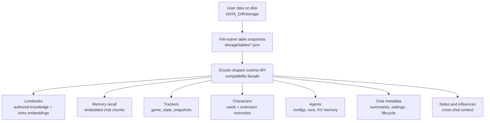
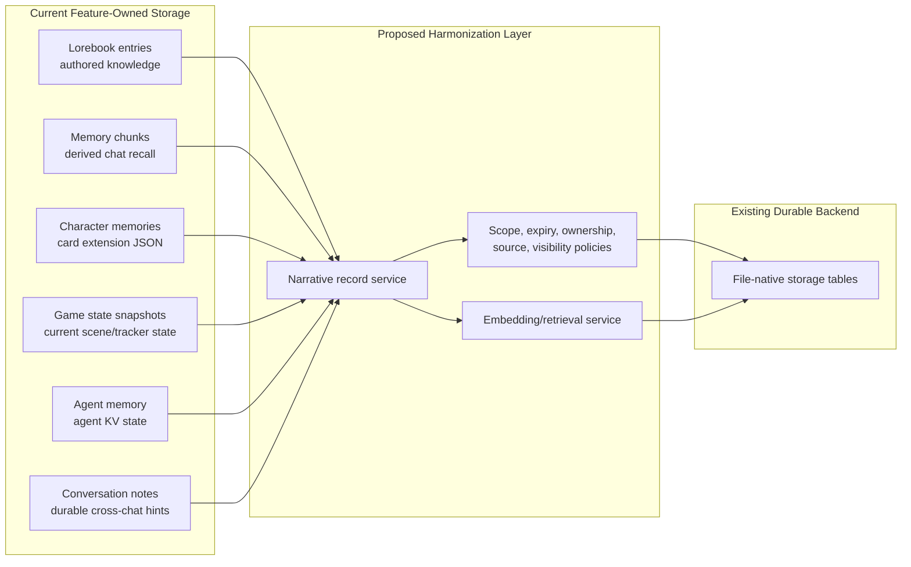
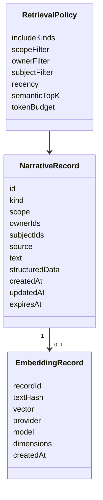
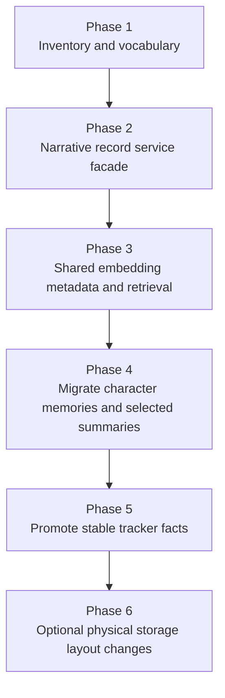
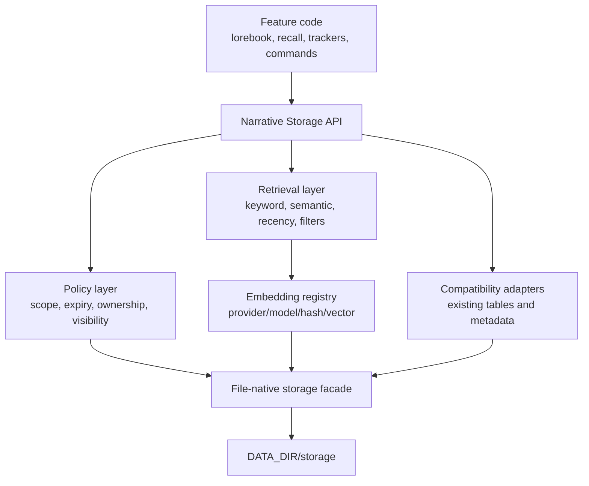

# CR008 Data Storage Assessment

Date: 2026-05-06

## Executive Summary

Marinara's storage is already unified at the infrastructure layer: user data is persisted through the file-native `DATA_DIR/storage` table snapshot store by default. The problem is higher up the stack. Narrative data is spread across feature-specific records, JSON blobs, cached embeddings, character-card extensions, game-state snapshots, and agent history.

The result is that several features are storing "things the app should remember", but each feature defines memory differently:

- Lorebooks store authored or agent-created reference knowledge.
- Memory recall stores embedded chat chunks.
- Character memory commands store short-lived character-to-character memories inside character card extensions.
- Trackers store current scene and character state inside game-state snapshots.
- Agent memory stores per-agent key/value state.
- Notes and influences store cross-chat context.
- Chat metadata stores summaries, flags, lifecycle state, schedules, and feature settings.

The recommended direction is not to replace the file-native backend. It is to add a cohesive library/narrative data layer above it: a typed record model and retrieval service that can describe authored lore, generated memories, tracker facts, notes, and embeddings consistently while preserving each feature's current behavior during migration.

## Current Big Picture

This means the backend is storage-centralized, but the product concepts are not. The app has one durable file store, but many separate definitions of memory, knowledge, state, and context.

## Strategic Diagnosis

The current system has three storage layers that are easy to conflate:

| Layer | What It Means | Current State | Recommendation |
| --- | --- | --- | --- |
| Durable backend | How data survives restart | File-native JSON table snapshots by default | Keep it. Do not reintroduce SQL as the primary solution. |
| Domain storage | Which feature owns each record | Fragmented across lorebooks, memory chunks, characters, game state, agents, chat metadata, notes | Add a coherent narrative/library service above the existing tables. |
| Retrieval/indexing | How relevant data is found | Keyword scan, local embeddings, provider embeddings, recent snapshot reads, direct metadata reads | Unify retrieval rules and embedding metadata before changing storage layout. |

The highest-value work is at the domain and retrieval layers. Replacing the backend first would not solve the conceptual fragmentation.

## Storage Strategy Map

The harmonization layer should not initially force every feature into one physical table. It should first provide one vocabulary and service boundary:

- What kind of thing is this?
- Who owns it?
- Who or what is it about?
- Where did it come from?
- Is it user-authored, agent-generated, derived, or operational?
- Should it expire?
- Can it be searched semantically?
- Can it be injected into prompts?
- What deletes it?

## Recommended Model

A future implementation CR should introduce a typed narrative record model, either as a new table or as a service abstraction backed by existing tables during migration.

Suggested `kind` values:

| Kind | Purpose |
| --- | --- |
| `lore_entry` | Authored or agent-created reference knowledge. |
| `memory_chunk` | Derived recall fragments from chat history. |
| `character_memory` | Character-to-character or scene-derived memories. |
| `tracker_fact` | Stable facts promoted from tracker snapshots. |
| `tracker_snapshot` | Current or historical scene-state snapshot references. |
| `conversation_note` | Durable cross-chat prompt note. |
| `ooc_influence` | One-shot cross-chat influence. |
| `agent_memory` | Agent-owned durable key/value state when exposed as narrative context. |
| `summary` | Rolling or dated summaries currently stored in chat metadata. |

## What Should Stay Separate

Unification should not mean flattening everything into the same product concept.

| Data Type | Should It Become A Narrative Record? | Reason |
| --- | --- | --- |
| Lorebook entries | Yes, as authored library records or indexed sources | They are explicit user-facing knowledge. |
| Memory chunks | Maybe, or derived index records | They are generated from messages and can be rebuilt. |
| Character memories | Yes | They are user-visible narrative facts with source/target semantics. |
| Tracker snapshots | Partly | Full snapshots are state history; selected stable facts may become library records. |
| Agent runs | Mostly no | Execution history is operational; selected outputs may be promoted. |
| Agent memory | Maybe | Some KV entries are operational, some are durable narrative state. |
| Chat metadata settings | No | Settings should remain settings. Summaries inside metadata may deserve first-class records. |
| Assets/galleries/themes | No | These are media/settings/catalog storage, not narrative memory. |

The design should preserve these distinctions. The goal is coherent storage and retrieval, not a single undifferentiated bucket.

## Main Problems To Solve

### 1. Same Concept, Different Storage

"Memory" currently appears as chat summary metadata, memory chunks, character card extension memories, conversation notes, agent memory, and sometimes tracker state. These do not share a schema, lifecycle, retrieval policy, or UI model.

Solution direction: define narrative records and policies so features can store memory-like data with clear kind, scope, source, owner, subject, expiry, and retrieval behavior.

### 2. Split Embedding Systems

Lorebook semantic search uses configured embedding providers. Memory recall uses the local embedder. Both store JSON float arrays and compute similarity in process, but they are not part of one embedding registry.

Solution direction: introduce embedding metadata and an embedding service that knows provider, model, dimensions, text hash, and source record. Do not compare vectors from incompatible embedding spaces.

### 3. Character Memories Are Hidden Inside Character Cards

The memory command writes to `extensions.characterMemories`. Scene conclusion also writes there. Conversation awareness reads and prunes these memories by date. This makes character memory easy to attach to a card but hard to search, inspect, migrate, expire, or query by source/target.

Solution direction: move character memories toward first-class records with compatibility reads/writes for existing card extensions.

### 4. Trackers Mix Current State With Long-Term Knowledge

Trackers are good at current scene state. `game_state_snapshots` correctly captures message/swipe-specific state, but not every tracker output is the same kind of data. Some tracker outputs are transient, while others become stable facts the app may want to recall later.

Solution direction: keep snapshots for state history, but allow selected stable facts to be promoted into narrative records.

### 5. Chat Metadata Is Overloaded

`chats.metadata` stores summaries, feature flags, active lorebook IDs, scene lifecycle state, schedules, prompt settings, and other feature-specific fields. This is convenient but makes ownership, migration, and validation hard.

Solution direction: do not move all metadata at once. Start by identifying memory-like metadata such as summaries and schedules, then decide which should become first-class records or typed metadata.

## Proposed Phased Approach

### Phase 1: Inventory And Vocabulary

Complete this CR's assessment and agree the vocabulary:

- Library data
- Narrative records
- Runtime state
- Operational agent state
- Derived indexes
- Prompt context

### Phase 2: Service Facade

Create a service that can read/write narrative records while still using existing storage underneath. Early implementation can be conservative:

- No migration required.
- Existing routes keep their behavior.
- The service provides normalized reads for assessment, diagnostics, and future retrieval.

### Phase 3: Shared Embedding And Retrieval

Add embedding metadata and a retrieval service:

- Track provider/model/dimensions.
- Store text hash to avoid stale embeddings.
- Centralize cosine similarity and top-K logic.
- Keep brute-force scanning initially, but hide it behind an interface.

### Phase 4: Character Memories And Summaries

Move the highest-value fragmented memory surfaces first:

- Character memory command records.
- Scene-derived character memories.
- Rolling chat summaries or durable conversation notes, if approved.

Compatibility is critical: existing character cards with `extensions.characterMemories` must still read correctly.

### Phase 5: Tracker Fact Promotion

Keep `game_state_snapshots` as the source for current scene state, but allow selected tracker outputs to create stable records, such as:

- A character acquired an injury.
- A character's outfit changed persistently.
- A quest fact changed.
- A custom tracker field should persist beyond the current scene.

### Phase 6: Physical Layout Changes

Only after behavior is stable, consider changing file layout:

- Keep table snapshots for small domains.
- Use append-friendly files for high-volume domains.
- Use domain-native directories for character/lorebook records.
- Consider a vector index only if retrieval cost requires it.

## Target Architecture

The important boundary is the Narrative Storage API. It lets the app improve semantics without requiring every storage table to be physically redesigned in the first implementation.

## Bottom-Up Reference

### Storage Surface Summary

| Surface | Current Durable Location | Current Role | Search/Retrieval | Harmonization Fit |
| --- | --- | --- | --- | --- |
| Lorebooks | `lorebooks`, `lorebook_entries`, `lorebook_folders` | Authored/agent-created knowledge | Keyword scan plus optional semantic fallback | Strong candidate for shared retrieval/indexing. |
| Lorebook embeddings | `lorebook_entries.embedding` | Entry-level semantic activation | Provider embedding, cosine in process | Move toward shared embedding metadata. |
| Memory recall | `memory_chunks` | Derived chat-history recall | Local embedder, cosine in process | Candidate for shared retrieval, but maybe remains derived/cache data. |
| Character memory command | `characters.data.extensions.characterMemories` | Character-to-character memory | Recent same-day awareness injection | Strong candidate for first-class narrative records. |
| Scene memories | `characters.data.extensions.characterMemories` | Scene summary attached to participating characters | Schedule continuity and awareness contexts | Same as character memories, with scene source metadata. |
| Built-in trackers | `game_state_snapshots` | Current scene/world/persona/character state | Latest/committed snapshot reads | Keep snapshots; promote stable facts selectively. |
| Custom trackers | `game_state_snapshots.playerStats.customTrackerFields` | User-defined tracked fields | Latest snapshot reads | Keep snapshot storage; consider promotion rules. |
| Agent memory | `agent_memory` | Per-agent per-chat KV | Direct KV reads | Classify per key before exposing as library data. |
| Agent runs | `agent_runs` | Execution history and cached outputs | Latest/recent run reads | Mostly operational; selected outputs may be promotable. |
| Chat summaries | `chats.metadata.summary`, day/week summaries | Condensed chat continuity | Direct metadata injection | Candidate for typed summary records. |
| Chat settings/lifecycle | `chats.metadata` | Feature settings and runtime flags | Direct reads | Should remain metadata, but needs stronger typing. |
| Conversation notes | `conversation_notes` | Durable cross-chat prompt notes | List by target chat | Candidate for narrative records with expiry/visibility. |
| OOC influences | `ooc_influences` | One-shot cross-chat context | Pending list by target chat | Candidate for narrative records or explicit event queue. |
| Game checkpoints | `game_checkpoints` | Restorable game state | Direct checkpoint reads | Keep separate from library memory. |

### Feature-by-Feature Notes

#### Lorebook Semantic Search

Current behavior is conceptually clear: lorebook entries are explicit knowledge units. The weak point is embedding isolation. Embeddings live directly on entries without provider/model/dimension metadata. This is acceptable while one lorebook is vectorized with one provider, but it becomes risky if the app later searches across lorebooks, memories, and generated facts.

Recommendation: keep lorebook entries as the authoring source, but move semantic indexing toward a shared embedding registry.

#### Memory Recall

Memory recall stores generated chunks of chat history. These are not authored facts; they are derived index records. The current design is simple and portable, but it is not a general memory library. It only stores chunk text and embedding, then brute-force scans recent chunks.

Recommendation: treat memory chunks as derived recall records. They can participate in unified retrieval, but should remain rebuildable from source messages where possible.

#### Character Memories

Character memories currently behave like short-lived awareness hints, not a durable memory library. They are attached to character cards, pruned by date in conversation generation, and not semantically searchable.

Recommendation: promote these to first-class records first, because they have clear user-facing semantics and clear source/target metadata.

#### Trackers

Trackers produce state snapshots, which are valuable but not the same as long-term memory. A snapshot answers "what is true at this turn?" A library record answers "what should be remembered and retrieved later?"

Recommendation: keep snapshots as snapshots. Add explicit promotion paths for stable facts, probably controlled by agent output type, user setting, or manual confirmation.

#### Agent Memory

Agent memory is per-agent KV storage. Some entries are implementation details, while others may be meaningful narrative state. Treating all agent memory as library data would leak internal state into user-facing retrieval.

Recommendation: classify agent memory keys before exposing them to shared retrieval.

#### Notes And Influences

Notes and influences already have clearer lifecycles than many memory surfaces: notes persist until cleared or pruned; influences are consumed once. They are good candidates for a shared policy model because they already carry source chat, target chat, and consumption/retention semantics.

Recommendation: model them as narrative records or queues with explicit lifecycle policies.

## Decision Points For The Next CR

1. Choose whether the first implementation target is a facade over existing storage or a new physical `narrative_records` table.
2. Decide which record kinds are in scope for the first implementation. Recommended: `character_memory`, `conversation_note`, `summary`, and embedding metadata.
3. Decide whether lorebook embeddings move immediately or are only wrapped by the retrieval service.
4. Decide whether memory chunks remain a derived cache or become visible library records.
5. Define compatibility behavior for existing `extensions.characterMemories`.
6. Define embedding-provider policy so cross-source semantic search does not mix incompatible vectors.

## Recommended First Implementation Slice

The lowest-risk useful slice is:

1. Add a narrative record type model and storage service.
2. Add compatibility adapters for existing character memories and conversation notes.
3. Add embedding metadata types, but do not migrate all embeddings yet.
4. Add read-only diagnostics or internal retrieval APIs to compare current and unified views.
5. Leave prompt injection behavior unchanged until the unified records are proven equivalent.

This gives the app a cohesive library vocabulary without immediately forcing a risky migration of lorebooks, trackers, or memory recall.

## Open Questions

- Should the user see one "Library" UI that includes lore, memories, notes, summaries, and promoted facts?
- Should character memory expiry remain same-day by default, or become explicit per memory?
- Which generated records should require user confirmation before becoming durable?
- Should semantic retrieval be per-chat by default, or can users opt into character/global/library scopes?
- Should the app support multiple embedding spaces side by side, or require one configured embedding profile for shared library search?
- How should exports represent unified narrative records while preserving compatibility with existing card/lorebook formats?
