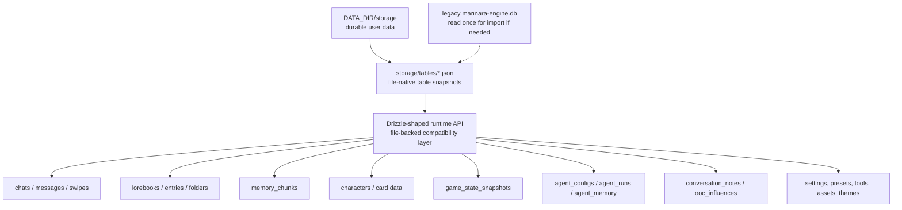
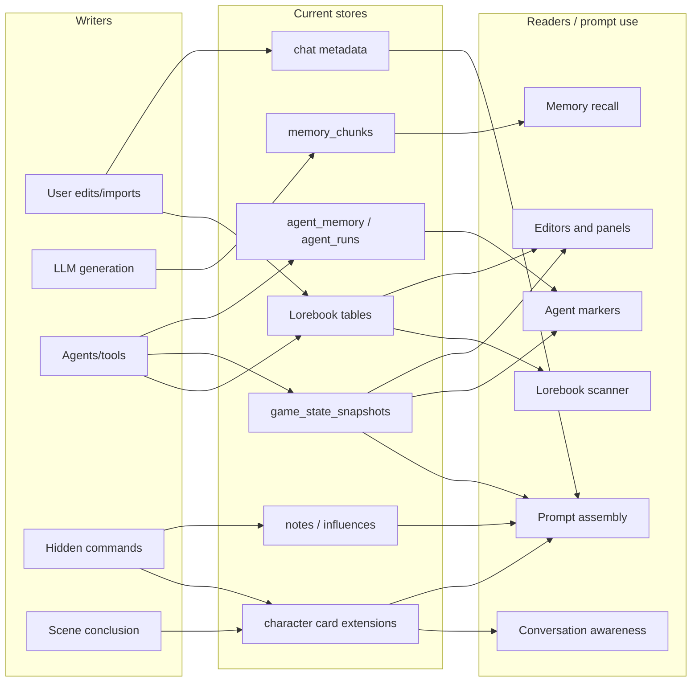
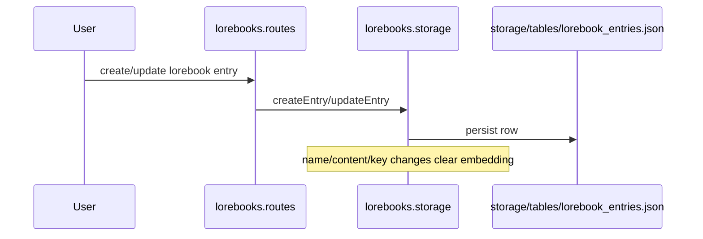
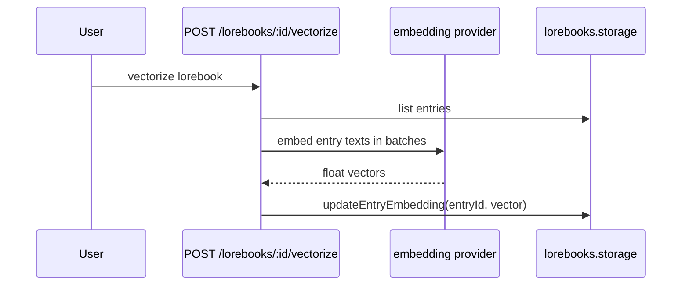
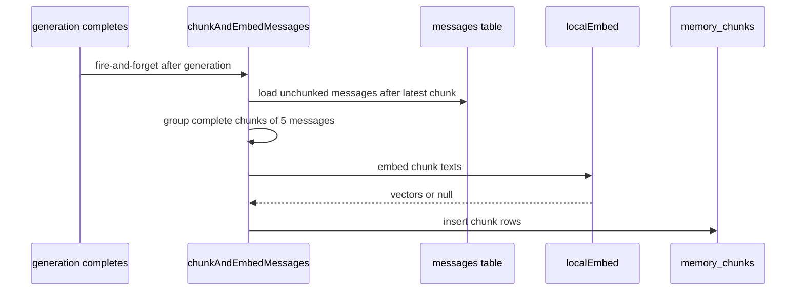
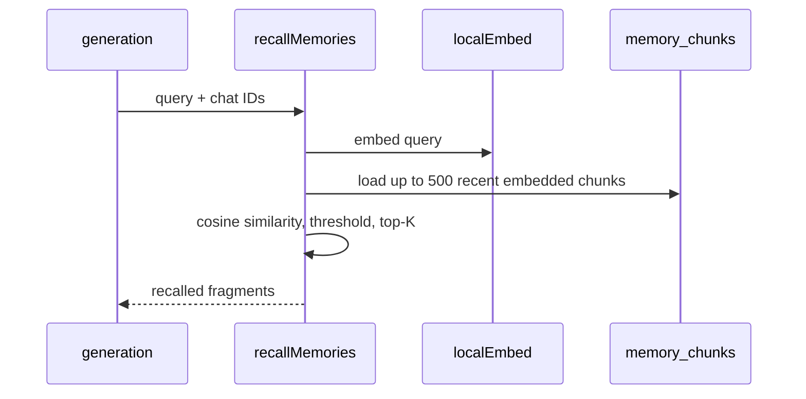
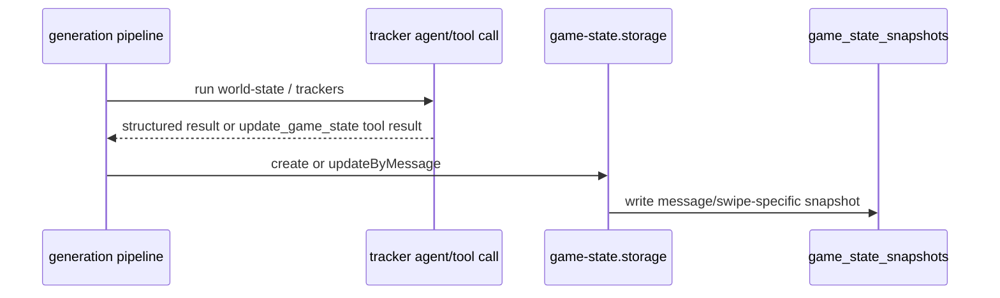
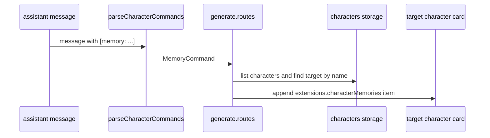
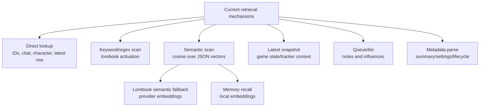

# CR008 Current Data Storage Assessment

Date: 2026-05-06

## Purpose

This document assesses how Marinara Engine currently stores, retrieves, and injects data across features that behave like memory, knowledge, state, or durable context.

The future desire to harmonize storage is useful background, but this assessment is intentionally current-state focused. It does not propose a target architecture or implementation plan. It documents what the app does today, where data lives, how each feature uses it, and what that means for any later design work.

## Executive Summary

Marinara's current durable storage is file-native by default. User data is written under `DATA_DIR/storage`, primarily as table-shaped JSON snapshots in `storage/tables/*.json`. The app still exposes a Drizzle-shaped runtime database API internally, but current default installs are not using a live SQLite database as the durable source of truth.

At the feature level, storage is not organized around one shared concept of "library data" or "memory". Instead, each feature owns its own records and lifecycle:

- Lorebooks store authored or agent-created knowledge, with optional per-entry embeddings for semantic activation.
- Memory recall stores derived chat-history chunks with local embeddings.
- Trackers store current or historical scene state in game-state snapshots.
- Custom trackers store user-defined tracked values inside the same snapshot structure.
- Character memory commands store target-character memories inside character card extension JSON.
- Scene conclusion also stores scene summaries inside character card extension JSON.
- Agent memory stores per-agent, per-chat key/value state.
- Conversation notes and OOC influences store cross-chat context as separate tables.
- Chat metadata stores summaries, feature settings, active lorebook choices, schedule data, and lifecycle flags in one broad JSON object.

The most important current-state finding is that the app already has one default durable backend, but multiple independent feature storage models. The fragmentation is conceptual and behavioral rather than simply "which database is used".

## Current Storage Layers



### What This Means

The current storage design has two separate truths:

| Area | Current Truth |
| --- | --- |
| Durable backend | File-native storage is the default source of truth. |
| Runtime API shape | Server code still mostly talks through Drizzle-style table operations. |
| SQLite | Legacy/import path or explicit opt-in backend, not the normal current durable store. |
| Feature ownership | Each feature still decides its own schema, lifecycle, and retrieval behavior. |

## Current Feature Map



The same high-level product need, "give the model useful stored context", is implemented through several separate paths.

## Storage Surface Summary

| Surface | Durable Location Today | Written By | Read By | Retrieval Style | Lifecycle |
| --- | --- | --- | --- | --- | --- |
| Lorebook metadata | `storage/tables/lorebooks.json` | User, imports, agents | UI, prompt/lorebook services | Direct lookup/filtering | User-managed |
| Lorebook entries | `storage/tables/lorebook_entries.json` | User, imports, Lorebook Keeper, maker routes | Lorebook scanner, UI, knowledge agents | Keyword scan, filters, optional semantic fallback | User-managed; entry edits can clear embedding |
| Lorebook embeddings | `lorebook_entries.embedding` | `POST /lorebooks/:id/vectorize` | Lorebook keyword scanner semantic fallback | Cosine similarity in process | Explicit vectorization; invalidated on entry text/key changes |
| Memory recall chunks | `storage/tables/memory_chunks.json` | `chunkAndEmbedMessages()` after generation | `recallMemories()` during generation | Local embedding + cosine similarity over recent chunks | Derived from messages; complete groups of 5 messages |
| Character memories | `characters.data.extensions.characterMemories` in `storage/tables/characters.json` | `[memory: ...]` command, scene conclusion | Conversation awareness, schedule continuity | Direct array read, date filtering | Conversation path prunes old same-day memories |
| Built-in tracker state | `storage/tables/game_state_snapshots.json` | World-state, character-tracker, persona-stats, quest/combat tool paths | Prompt assembly, marker expansion, UI | Latest/committed snapshot lookup | Message/swipe-specific snapshots; committed after user continues |
| Custom tracker fields | `game_state_snapshots.playerStats.customTrackerFields` | Custom tracker agent via `update_game_state` | Game state readers, prompt context/UI | Latest snapshot lookup | Stored as part of game state snapshots |
| Agent run history | `storage/tables/agent_runs.json` | Agent executor | Marker expansion, recent run views, echo chamber reads | Latest/recent successful run queries | Operational history; can be cleared per chat |
| Agent memory | `storage/tables/agent_memory.json` | Agent storage APIs/tools | Agent executor/context | Direct per-agent per-chat KV lookup | Explicit set/delete/clear APIs |
| Chat metadata | `storage/tables/chats.json`, `metadata` column | Many routes/features | Prompt assembly, settings, scheduling, scene lifecycle | Direct JSON parse | Broad JSON bag; patched by feature code |
| Conversation notes | `storage/tables/conversation_notes.json` | `<note>` command | Connected roleplay prompt injection | List by target chat | Durable until cleared; pruned by character budget |
| OOC influences | `storage/tables/ooc_influences.json` | `<influence>` command | Connected roleplay prompt injection | Pending list by target chat | One-shot; marked consumed |
| Messages/swipes | `storage/tables/messages.json`, `message_swipes.json` | Chat routes/generation/import | Chat UI, prompt assembly, memory chunking | Chronological/paginated reads | User chat history |

## Lorebook Semantic Search

### Current Role

Lorebooks are the app's explicit knowledge store. They contain entries that can be injected into prompts when relevant. Relevance is primarily keyword-based, with optional semantic fallback for entries that have embeddings.

### Current Write Path



Vectorization is separate:



### Current Read/Injection Path

- Active lorebooks are determined from chat attachment, linked character, linked persona, chat-scoped lorebook, and enabled state.
- Entries are filtered by enabled state and disabled folders.
- Entry activation checks constant entries, probability, timing, activation conditions, schedules, character filters, tag filters, generation-trigger filters, primary keys, secondary keys, and optional extra matching sources.
- Semantic fallback only runs when a chat-context embedding exists and the entry has an embedding.
- Similarity is computed in process by `scanForActivatedEntries()`.

### Current Storage Characteristics

| Characteristic | Current Behavior |
| --- | --- |
| Canonical content | `lorebook_entries.content`, `name`, `keys`, filters, schedules, etc. |
| Embedding location | Same entry row, `embedding` field |
| Embedding provider | Selected connection's embedding model/base URL or embedding connection override |
| Embedding freshness | Cleared when entry name/content/keys/secondary keys change |
| Retrieval scope | Active lorebook entries for the current chat/generation context |
| Vector index | No dedicated vector index; in-process cosine scoring |

## Memory Recall

### Current Role

Memory recall is a derived semantic recall system over past chat messages. It does not store curated facts. It stores chunks of formatted transcript text and uses embeddings to retrieve relevant fragments later.

### Current Write Path



### Current Read/Injection Path



### Current Storage Characteristics

| Characteristic | Current Behavior |
| --- | --- |
| Stored unit | Formatted transcript chunk |
| Chunk size | Complete groups of 5 messages |
| Embedding location | `memory_chunks.embedding` |
| Embedding provider | Local embedder, `Xenova/all-MiniLM-L6-v2` |
| Disable conditions | `MARINARA_LITE`, missing ONNX binding, local model load failure |
| Retrieval scope | Supplied chat IDs; current generation path appears chat-scoped |
| Max scanned chunks | 500 recent embedded chunks |
| Similarity threshold | `0.25` |
| Default top-K | 8 |
| Vector index | No dedicated vector index; in-process cosine scoring |

## Built-In Trackers

### Current Role

Built-in trackers store structured current-state data for roleplay/game contexts. They are not stored as free-standing memories. Their primary durable unit is a game-state snapshot associated with a chat, message, and swipe index.

### Main Tracker Surfaces

| Tracker | Stored Fields | Current Durable Location |
| --- | --- | --- |
| World state | date, time, location, weather, temperature | `game_state_snapshots` |
| Character tracker | present characters, mood, appearance, outfit, custom fields, stats, thoughts | `game_state_snapshots.presentCharacters` |
| Persona stats | persona status bars | `game_state_snapshots.personaStats` |
| Quest/combat updates | quest/combat-related state through game-state tool paths | `game_state_snapshots` and related game/lorebook data depending on feature |

### Current Write Path



### Current Read Path

- Prompt assembly and marker expansion read latest or committed snapshots.
- UI components read game state to show current scene, NPC tracker, persona stats, and related fields.
- Snapshot lookup is usually by chat, message ID, and swipe index, with fallbacks to latest state when needed.

### Current Storage Characteristics

| Characteristic | Current Behavior |
| --- | --- |
| Stored unit | Full state snapshot |
| Scope | Chat + message + swipe |
| Commit model | Snapshot can be marked committed after the user continues |
| Mutation model | Later tracker agents update the same message/swipe snapshot or clone latest if needed |
| Manual edits | Manual overrides can be tracked for selected world-state fields |
| Retrieval style | Latest/committed snapshot lookup, not semantic search |

## Custom Trackers

### Current Role

Custom trackers let users define fields that should be tracked throughout roleplay. The tracked output is stored inside the same game-state snapshot model as built-in tracker state.

### Current Behavior

- Custom tracker prompts ask the model to update only user-defined custom fields.
- Persistence flows through the same `update_game_state` handling used by built-in state updates.
- The durable user-facing state is stored under `game_state_snapshots.playerStats.customTrackerFields` or related snapshot fields.
- Agent run history also records custom tracker results, but `agent_runs` is not the canonical current tracker state.

### Current Storage Characteristics

| Characteristic | Current Behavior |
| --- | --- |
| Stored unit | Field values embedded in a game-state snapshot |
| Scope | Current chat/message/swipe snapshot |
| Retrieval style | Latest snapshot read |
| Search | No semantic search |
| Lifecycle | Follows game-state snapshot lifecycle |

## Character Memory Command

### Current Role

The memory command lets one character give another character a short memory. It is implemented as hidden command parsing in generated character messages.

Example command shape:

```text
[memory: target="CharName", summary="description of the memory"]
```

### Current Write Path



Stored shape is effectively:

```ts
{
  from: string;
  fromCharId: string;
  summary: string;
  createdAt: string;
}
```

### Current Read/Injection Path

- Conversation generation reads active characters' `extensions.characterMemories`.
- It filters to memories created today or later.
- It deletes older memories from the character card as part of the generation path.
- Valid memories are appended to the conversation awareness block under `## Memories`.
- Schedule generation can also read recent character memories for continuity.

### Current Storage Characteristics

| Characteristic | Current Behavior |
| --- | --- |
| Durable location | Character card data JSON, `extensions.characterMemories` |
| Target resolution | Target character found by lowercased display name across all characters |
| Source | Current generating character, if available |
| Retrieval style | Direct array read |
| Search | No keyword or semantic search |
| Expiry | Conversation generation keeps same-day memories and prunes older ones |
| Scope | Stored on target character, not directly on chat |

## Scene-Derived Character Memories

### Current Role

When a scene concludes, the generated scene summary is stored as a permanent-looking memory on each participating character, using the same `extensions.characterMemories` array used by the memory command.

### Current Write Path

- Scene conclusion generates a summary.
- The summary is inserted as a narrator message in the origin conversation.
- For each participating character, the summary is appended to `extensions.characterMemories`.
- The memory uses `from` as the persona name and `fromCharId` as `"scene"`.

### Current Assessment

Scene memories and command memories share the same physical storage but have different lifecycle expectations:

- Command memories are described in generation comments as awareness context cleaned up after the day ends.
- Scene summaries are described as permanent memories when scene concludes.
- Conversation generation's same-day pruning path can affect anything in `extensions.characterMemories`, regardless of whether it came from a command or scene conclusion.

This is a current behavior detail to verify further before any design change: the shared array may be carrying both short-lived and longer-lived memory intents.

## Agent Memory And Agent Runs

### Agent Memory

Agent memory is persistent key/value state scoped by agent config and chat.

| Characteristic | Current Behavior |
| --- | --- |
| Durable location | `storage/tables/agent_memory.json` |
| Scope | `agentConfigId` + `chatId` + `key` |
| Value format | Stored as string; JSON serialized for non-string values |
| APIs | get, set, delete key, clear per chat, clear per agent/chat |
| Retrieval | Direct KV read for agent context |

### Agent Runs

Agent runs store execution results and history.

| Characteristic | Current Behavior |
| --- | --- |
| Durable location | `storage/tables/agent_runs.json` |
| Stored data | agent config, chat, message, result type, JSON result data, token/duration/success/error |
| Retrieval | latest successful run by type, latest run by type, recent custom runs, echo messages |
| Role | Operational history plus some prompt-marker context |

## Chat Metadata And Summaries

### Current Role

`chats.metadata` is a broad JSON object used by many features.

Known current uses include:

- rolling chat summary
- tags
- agent enablement and overrides
- active agent/tool IDs
- active lorebook IDs and per-entry overrides
- memory recall setting
- schedule data and schedule preferences
- scene lifecycle fields
- connected chat state
- image/TTS/translation/advanced prompt settings depending on feature
- day/week summaries

### Current Storage Characteristics

| Characteristic | Current Behavior |
| --- | --- |
| Durable location | `storage/tables/chats.json`, `metadata` field |
| Shape | JSON object |
| Ownership | Shared by many features |
| Update model | Full metadata updates and queued patching helpers |
| Retrieval | Direct parse by each feature |
| Validation | Feature-specific, not one central discriminated metadata model |

### Assessment

Chat metadata currently mixes settings, runtime lifecycle, user choices, and memory-like summaries. This is important current behavior because some stored context is not in separate memory tables at all; it exists only as metadata fields.

## Conversation Notes And OOC Influences

### Conversation Notes

Conversation notes are durable cross-chat context emitted from conversation mode to a connected roleplay.

| Characteristic | Current Behavior |
| --- | --- |
| Durable location | `storage/tables/conversation_notes.json` |
| Write trigger | `<note>text</note>` command |
| Scope | source chat + target chat + optional anchor message |
| Retrieval | list all notes for target chat, oldest first |
| Lifecycle | persists until cleared; oldest pruned past character budget |

### OOC Influences

OOC influences are one-shot cross-chat context.

| Characteristic | Current Behavior |
| --- | --- |
| Durable location | `storage/tables/ooc_influences.json` |
| Write trigger | `<influence>text</influence>` command |
| Scope | source chat + target chat + optional anchor message |
| Retrieval | list pending unconsumed influences for target chat |
| Lifecycle | marked consumed after use |

## Data Storage Categories Observed Today

The current system stores several different categories of data. These categories are implicit in behavior rather than formalized in one place.

| Category | Examples | Current Storage Pattern |
| --- | --- | --- |
| Authored library content | lorebooks, characters, personas, prompt presets, regex scripts, custom tools | Dedicated tables and editor routes |
| Derived recall data | memory chunks, embeddings | Dedicated table or entry field, generated from source content |
| Current scene state | world state, character tracker, persona stats, custom trackers | Game-state snapshots |
| Character-attached memories | memory command, scene summaries | Character card extension JSON |
| Agent operational state | agent runs, agent memory | Agent tables |
| Cross-chat prompt context | notes, influences | Dedicated chat-link tables |
| Broad chat configuration/state | summaries, active lorebooks, schedules, scene flags | Chat metadata JSON |
| Media and assets | gallery, avatars, generated images, themes | Dedicated asset/theme/gallery tables and files |

## Current Retrieval Styles



Important current detail: semantic retrieval exists in two separate systems, but both use JSON-stored vectors and in-process cosine similarity rather than a dedicated vector database/index.

## Current Lifecycle Patterns

| Pattern | Examples | Current Behavior |
| --- | --- | --- |
| User-managed durable content | lorebooks, characters, personas, prompt presets | Persists until user deletes/edits |
| Derived/generated cache | memory chunks, embeddings | Generated from content; can become stale or absent depending on embedding availability |
| Message/swipe state history | game-state snapshots | Created/updated around generation, tied to message/swipe |
| Same-day awareness memory | memory command entries | Pruned by conversation generation based on date |
| One-shot queue | OOC influences | Consumed after injection |
| Durable-until-cleared prompt note | conversation notes | Persists until cleared or pruned for budget |
| Operational history | agent runs | Retained until cleared/delete operations |
| Broad JSON metadata | chat metadata | Patched by feature code; lifecycle depends on individual fields |

## Current Behavior Findings

1. File-native storage is the default durable backend.
2. The internal API still uses table-shaped operations, so many code paths still look database-like even when data persists as JSON table snapshots.
3. Lorebook semantic search and memory recall are separate semantic systems with different embedding sources.
4. Current semantic search is brute-force in-process scoring over stored vectors, not an indexed vector database.
5. Character memories are not first-class rows; they are embedded in character card extension JSON.
6. Scene summaries and memory commands currently share the same character memory array despite appearing to have different retention expectations.
7. Built-in and custom trackers persist as game-state snapshots, not as searchable memory or lore records.
8. Agent memory is structured as operational per-agent KV state, not as general library memory.
9. Chat metadata is a significant storage surface for summaries, settings, schedules, and lifecycle data.
10. Notes and influences are distinct cross-chat context mechanisms with clearer lifecycles than many other memory-like surfaces.

## Current Ambiguities To Verify Later

These are not proposed fixes. They are current-behavior questions that should be verified before design work:

- Whether scene-derived character memories are unintentionally pruned by the same same-day cleanup used for command memories.
- Which generation modes currently call memory recall and with which chat IDs.
- Whether any UI exposes `extensions.characterMemories` directly or only generation/schedule paths consume it.
- Which chat metadata summary fields are currently authoritative for each mode.
- Whether custom tracker configuration is fully metadata-owned, agent-settings-owned, or split depending on path.
- Whether lorebook embeddings from different providers/models can coexist in one lorebook or active search set today.

## Reference Files

Current behavior was assessed from these areas:

- `Marinara-Engine/docs/FILE_STORAGE_MIGRATION.md`
- `Marinara-Engine/packages/server/src/db/connection.ts`
- `Marinara-Engine/packages/server/src/db/schema/chats.ts`
- `Marinara-Engine/packages/server/src/db/schema/lorebooks.ts`
- `Marinara-Engine/packages/server/src/services/memory-recall.ts`
- `Marinara-Engine/packages/server/src/services/local-embedder.ts`
- `Marinara-Engine/packages/server/src/services/storage/chats.storage.ts`
- `Marinara-Engine/packages/server/src/services/storage/lorebooks.storage.ts`
- `Marinara-Engine/packages/server/src/services/storage/game-state.storage.ts`
- `Marinara-Engine/packages/server/src/services/storage/agents.storage.ts`
- `Marinara-Engine/packages/server/src/services/lorebook/keyword-scanner.ts`
- `Marinara-Engine/packages/server/src/services/conversation/character-commands.ts`
- `Marinara-Engine/packages/server/src/routes/generate.routes.ts`
- `Marinara-Engine/packages/server/src/routes/scene.routes.ts`
- `Marinara-Engine/packages/server/src/routes/conversation.routes.ts`
- `Marinara-Engine/packages/shared/src/types/game-state.ts`
