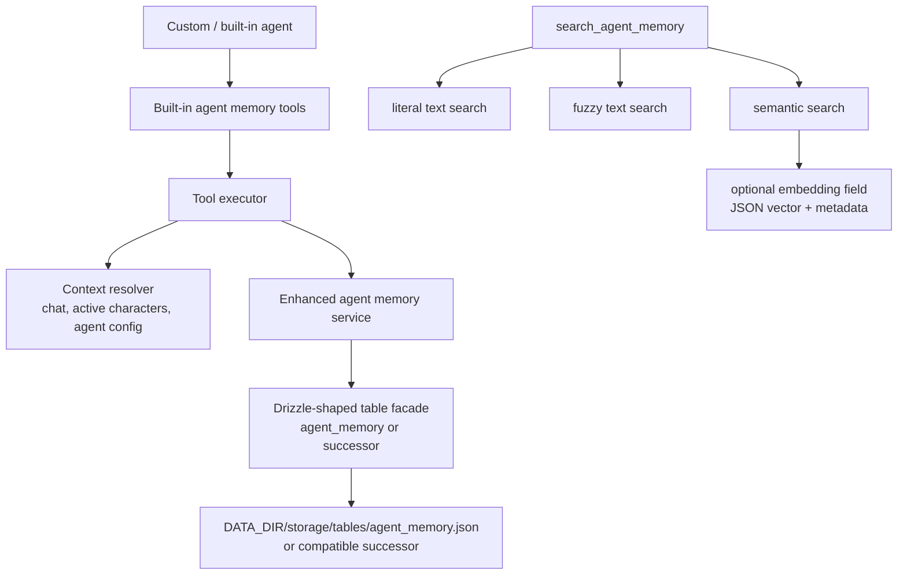

# CR009 Agent Memory Enhancement HLD

Status: Draft design
Date: 2026-05-08

## Problem Statement

Agents already have a narrow per-agent, per-chat key/value memory store in `agent_memory`, but they need a more capable, tool-addressable memory model for records they intentionally save and later retrieve. The older vector-focused request correctly identified a gap, but its framing is now too narrow and partly stale:

- the desired feature is agent memory enhancement, not a vector store as the main product concept;
- CR008 confirms current durable storage is file-native JSON table snapshots, not a default live SQL database;
- semantic search should be an optional search mode, not the only retrieval path.

## Source Context

This CR is informed by:

- `change_requests/CR008_data_storage_harmonization/ASSESSMENT.md`
- `change_requests/CR008_data_storage_harmonization/PREVIOUS_FEATURE_REQUEST.md`

CR008's current-state assessment establishes that agent-owned durable memory should not be forced into memory recall, lorebooks, tracker snapshots, character memory extensions, or chat metadata.

The assessment also identifies an existing `agent_memory` table backed by `storage/tables/agent_memory.json`. That table is per-agent, per-chat key/value storage and is currently used by the secret plot agent. CR009 should treat it as the incumbent storage surface to evaluate, not as something to ignore.

## Goals

- Add a feature request and implementation design for enhanced agent memory records.
- Define built-in tools:
  - `save_agent_memory`
  - `search_agent_memory`
  - `list_agent_memory`
  - `delete_agent_memory`
- Persist records through the current file-native table storage model, preferably by evolving or deliberately superseding existing `agent_memory`.
- Support literal, fuzzy, and semantic search modes in `search_agent_memory`.
- Treat vector/embedding storage as optional support for semantic search.
- Resolve model-facing scopes to server-side chat, character, and agent IDs.
- Decide whether to supersede, extend, or coexist with existing `agent_memory`.
- Preserve or deliberately migrate current `secret-plot-driver` memory behavior.
- Avoid automatic prompt injection in the initial feature; agents retrieve data explicitly by tool call.

## Non-Goals

- Do not replace Memory Recall or reuse `memory_chunks` as the canonical store.
- Do not write agent memory records into lorebooks by default.
- Do not store agent memory records in character card `extensions.characterMemories`.
- Do not use chat metadata as the generic agent memory store.
- Do not require an external vector database.
- Do not assume SQL as the durable backend.
- Do not migrate unrelated CR008-assessed storage surfaces in this CR.

## Proposed Current-Architecture Fit

The implementation should follow existing storage patterns: define table/schema and storage facade code so the file-backed runtime store persists a table snapshot. If legacy SQLite opt-in remains supported, the table shape may need migration/schema compatibility. The first design question is whether the primary durable file remains `storage/tables/agent_memory.json` with an expanded shape, or whether a successor table is introduced with compatibility reads from existing `agent_memory`.

## Incumbent: `agent_memory`

Current `agent_memory` is intentionally small:

| Field | Meaning |
| --- | --- |
| `id` | Row ID. |
| `agentConfigId` | Owning agent config. |
| `chatId` | Owning chat. |
| `key` | Memory key. |
| `value` | String value; JSON encoded by storage facade for non-string values. |
| `updatedAt` | Last update timestamp. |

Current storage behavior:

- File-native durable path: `storage/tables/agent_memory.json`.
- Storage API: `getMemory`, `setMemory`, `deleteMemoryKey`, `clearMemoryForChat`, `clearMemoryForAgentInChat`.
- Existing cleanup: deleting a chat or agent config deletes related rows.
- Secret plot behavior: `overarchingArc`, `sceneDirections`, `recentlyFulfilled`, `pacing`, and `staleDetected` are stored as keys.
- Special route behavior: clearing all agent runs/memory for a chat preserves and restores `overarchingArc`.

CR009 should decide between three implementation directions:

| Option | Description | Tradeoff |
| --- | --- | --- |
| Supersede | Build the enhanced agent memory layer and migrate/reroute current `agent_memory` use cases into it. | Cleaner long-term model, but requires compatibility for existing secret plot state. |
| Extend | Evolve `agent_memory` into a record-capable table/service. | Reuses existing concept/file, but may overload a KV-shaped table. |
| Coexist | Add a successor record table and leave `agent_memory` only for narrow internal KV state. | Lowest short-term risk, but leaves two agent storage surfaces. |

Given the user's concern, the HLD should not assume coexistence. The preferred direction is to evolve/supersede `agent_memory` into the enhanced record framework and reroute secret plot onto that framework, unless implementation analysis finds a concrete compatibility blocker.

## Data Model

Preferred enhanced `agent_memory` shape:

| Field | Purpose |
| --- | --- |
| `id` | Stable record ID returned to tools. |
| `memoryType` | `record` for enhanced records, `kv` for compatibility/internal state if needed. |
| `key` | Optional stable key for KV-style compatibility and upsert-by-key records. |
| `namespace` | Optional agent-defined bucket. |
| `title` | Optional human-readable label. |
| `content` | Required stored text. |
| `metadata` | JSON object. |
| `scopeType` | `chat`, `character`, `agent`, `chat_agent`, or `global_agent`. |
| `chatId` | Resolved server-side chat ID when scope requires it. |
| `characterId` | Resolved active character ID when scope requires it. |
| `agentConfigId` | Resolved executing agent config ID when scope requires it. |
| `embedding` | Optional JSON-serialized vector for semantic search. |
| `embeddingProvider` | Optional provider/source label. |
| `embeddingModel` | Optional embedding model label. |
| `contentHash` | Hash used to detect stale semantic index data. |
| `enabled` | Soft visibility flag. |
| `createdAt` | Creation timestamp. |
| `updatedAt` | Last update timestamp. |
| `deletedAt` | Soft delete timestamp, if used. |

`metadata` should be JSON only. The first implementation should keep filtering conservative to avoid inventing a complex query language.

The model also needs to represent existing KV-like internal state cleanly. That can be done either as records with `namespace = "internal"` and stable titles/keys, or as a compatibility adapter that maps old `agent_memory` keys onto enhanced memory records.

## Impacted Current Functionality

### Secret Plot Driver

The secret plot agent is the concrete existing consumer of `agent_memory`. Today each data point is stored as a key/value row scoped by `agentConfigId` and `chatId`.

Current row model:

| Column | Current secret plot use |
| --- | --- |
| `agentConfigId` | Secret plot agent config ID. |
| `chatId` | Current chat ID. |
| `key` | One of `overarchingArc`, `sceneDirections`, `recentlyFulfilled`, `pacing`, `staleDetected`. |
| `value` | JSON string for objects/arrays/booleans, parsed by `getMemory()`. |

Current call pattern:

1. Before pre-generation agent execution, `getMemory(secretPlotAgent.id, chatId)` loads prior state.
2. The loaded keys are injected into `agentContext.memory._secretPlotState`.
3. After the secret plot pre-generation result returns, `setMemory()` updates individual keys.
4. Later prompt assembly calls `getMemory()` again to inject the arc and active directions at their current prompt positions.
5. Clearing agent runs for a chat clears memory, but preserves and restores `overarchingArc`.

#### Current Keys And Required Mapping

These values should become individual keyed internal agent memory records in the enhanced model.

| Current `agent_memory` row | Mapped enhanced agent memory record |
| --- | --- |
| `key = "overarchingArc"`, `value = object/string` | `memoryType = "internal"`, `namespace = "secret_plot"`, `key = "overarchingArc"`, `scopeType = "chat_agent"`, `metadata.rawValue = value`, protected from normal clear. |
| `key = "sceneDirections"`, `value = active direction array` | `memoryType = "internal"`, `namespace = "secret_plot"`, `key = "sceneDirections"`, `scopeType = "chat_agent"`, `metadata.rawValue = value`. |
| `key = "recentlyFulfilled"`, `value = string array` | `memoryType = "internal"`, `namespace = "secret_plot"`, `key = "recentlyFulfilled"`, `scopeType = "chat_agent"`, `metadata.rawValue = value`. |
| `key = "pacing"`, `value = string/structured value` | `memoryType = "internal"`, `namespace = "secret_plot"`, `key = "pacing"`, `scopeType = "chat_agent"`, `content = string value when possible`, `metadata.rawValue = value`. |
| `key = "staleDetected"`, `value = boolean` | `memoryType = "internal"`, `namespace = "secret_plot"`, `key = "staleDetected"`, `scopeType = "chat_agent"`, `metadata.rawValue = value`. |

#### How Secret Plot Should Use The Enhanced Framework

Secret plot should not call `search_agent_memory` for these internal state values. Its access pattern is deterministic key lookup and update.

Required enhanced service methods:

| Method | Secret plot use |
| --- | --- |
| `getAgentMemoryMap(agentConfigId, chatId, namespace)` | Compatibility read that returns `{ [key]: value }` for `secret_plot`. This replaces or backs current `getMemory()`. |
| `setAgentMemoryKey(agentConfigId, chatId, namespace, key, value, options)` | Upsert one internal keyed record. This replaces or backs current `setMemory()`. |
| `clearAgentMemoryForChat(chatId, options)` | Clear agent memory for a chat while honoring protected keys such as `overarchingArc`. |
| `listAgentMemoryRecords(filters)` | Optional operational/debug listing; not required for prompt assembly. |

The existing `getMemory()` and `setMemory()` APIs can remain as compatibility wrappers during migration, but they should delegate to the enhanced memory service so there is one underlying framework.

#### Search/List/Delete Semantics For Internal Secret Plot Records

- `save_agent_memory`: model-facing agents should not normally overwrite secret plot internal keys unless the tool policy explicitly allows that agent and namespace.
- `search_agent_memory`: should exclude `memoryType = "internal"` records by default, unless an internal/debug flag or trusted built-in path requests them.
- `list_agent_memory`: may include internal records only for trusted built-in/admin contexts or when explicitly requested.
- `delete_agent_memory`: should protect internal records from ordinary model tool calls unless the caller has explicit authority.

This keeps the enhanced memory framework shared while avoiding accidental exposure or deletion of built-in agent control state.

#### Compatibility And Migration

Implementation should support existing installs with old `agent_memory` rows.

Acceptable compatibility paths:

1. Lazy adapter: read old `key`/`value` rows and present them as enhanced internal records in service responses, rewriting only when updated.
2. Startup/file migration: convert old rows to enhanced shape in `storage/tables/agent_memory.json`.
3. Dual-shape parser: allow both old KV rows and enhanced rows in the same file until a later cleanup.

Whichever path is chosen, tests must prove that a chat with existing secret plot memory produces the same prompt injections before and after the change.

### Existing Agent Memory APIs

The current storage facade exposes `getMemory`, `setMemory`, `deleteMemoryKey`, `clearMemoryForChat`, and `clearMemoryForAgentInChat`. CR009 should define whether these remain compatibility methods, become wrappers over the enhanced record service, or are replaced by record-oriented methods.

At handoff, there should not be two unrelated concepts both called agent memory.

## Tool Execution Context Requirements

The current `ToolExecutionContext` includes game state, chat metadata, metadata patching, custom tools, lorebook search, and some integration credentials. It does not expose enough identity for custom scoped storage.

The implementation should extend the context with:

| Field | Purpose |
| --- | --- |
| `chatId` | Store/search chat-scoped records. |
| `activeCharacters` | Validate `characterName` and resolve character IDs. |
| `agentConfigId` | Store/search records owned by the executing agent. |

The route/agent pipeline already has these concepts nearby: generation input includes the chat, active characters are loaded for prompt context, and each resolved agent has a config ID.

## Tool Behavior

### `save_agent_memory`

- Validate required `content`.
- Normalize `namespace`, `title`, and `metadata`.
- Resolve `scope` into internal IDs.
- Create a new record or update an existing `recordId`.
- Optionally generate/update an embedding if semantic indexing is requested and available.
- Return record ID, scope summary, namespace, title, and whether semantic index data was created.

### `search_agent_memory`

- Validate query and search mode.
- Resolve scope filters.
- Load bounded candidates by namespace/scope/enabled state.
- For `literal`, perform deterministic text matching.
- For `fuzzy`, perform lightweight text matching without embeddings.
- For `semantic`, embed query and score candidates with valid embeddings.
- Return record IDs, title/content snippets, metadata, scope summary, and scores when relevant.
- If semantic search is unavailable, return a clear tool result rather than a generic failure.

### `list_agent_memory`

- Resolve scope filters.
- Return paginated records by updated/created time.
- Include content conditionally based on `includeContent`.
- Never expose raw embeddings.

### `delete_agent_memory`

- Resolve current execution scope/ownership.
- Validate the record exists and is accessible.
- Soft-delete by default unless the final implementation chooses hard delete only.
- Return deletion status.

## Search Modes

| Mode | Current Requirement |
| --- | --- |
| `literal` | Exact/case-insensitive substring search over title/content/namespace. |
| `fuzzy` | Non-vector approximate matching, such as normalized token overlap. |
| `semantic` | Optional embedding-backed search over indexed records. |

Semantic search is useful, but records should remain valuable without it. `save_agent_memory`, `list_agent_memory`, `delete_agent_memory`, and literal/fuzzy search must not depend on local embedding availability.

## Risks

- Agents could save too much low-value memory without clear tool instructions.
- If scoping is too permissive, one agent could read/delete data meant for another agent or chat.
- Superseding `agent_memory` could regress the secret plot agent if `overarchingArc` preservation and scene direction lifecycle are not matched exactly.
- Semantic search can compare incompatible embeddings if provider/model metadata is ignored.
- Metadata filtering can become complex quickly if the first implementation attempts a broad query language.
- Soft delete behavior may create user-visible confusion if there is no UI or recovery path.
- File-native table snapshots may grow large if agents write aggressively; initial limits and pagination are required.

## Validation

- Unit tests for storage create/update/list/search/delete behavior.
- Unit tests for scope resolution and access control.
- Unit tests for literal and fuzzy search.
- Semantic search tests should mock embedding generation and verify unavailable-embedding behavior.
- Regression tests for current secret plot memory behavior if it is rerouted or migrated.
- Tool executor tests for all four built-in tools.
- `pnpm check` from `Marinara-Engine/`.
- Focused API/tool tests should be enough for the first implementation unless the user requests E2E validation.
