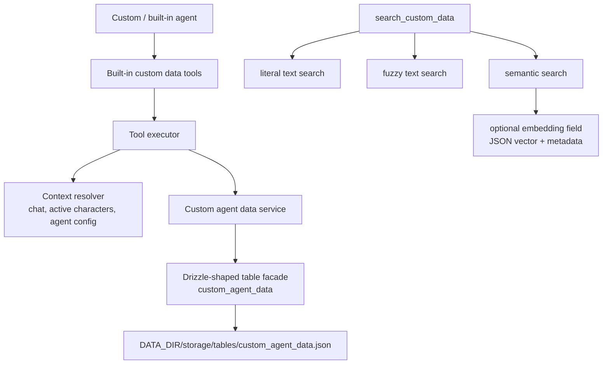

# CR009 Custom Agent Data Storage Tools HLD

Status: Draft design
Date: 2026-05-08

## Problem Statement

Custom agents need a durable, tool-addressable data store for records they intentionally save and later retrieve. The older vector-focused request correctly identified a gap, but its framing is now too narrow and partly stale:

- the desired feature is custom agent data storage, not a vector store as the main product concept;
- CR008 confirms current durable storage is file-native JSON table snapshots, not a default live SQL database;
- semantic search should be an optional search mode, not the only retrieval path.

## Source Context

This CR is informed by:

- `change_requests/CR008_data_storage_harmonization/ASSESSMENT.md`
- `change_requests/CR008_data_storage_harmonization/PREVIOUS_FEATURE_REQUEST.md`

CR008's current-state assessment establishes that custom-agent durable data should not be forced into memory recall, lorebooks, tracker snapshots, character memory extensions, or chat metadata.

## Goals

- Add a feature request and implementation design for custom-agent-owned durable data records.
- Define built-in tools:
  - `save_custom_data`
  - `search_custom_data`
  - `list_custom_data`
  - `delete_custom_data`
- Persist records through the current file-native table storage model.
- Support literal, fuzzy, and semantic search modes in `search_custom_data`.
- Treat vector/embedding storage as optional support for semantic search.
- Resolve model-facing scopes to server-side chat, character, and agent IDs.
- Avoid automatic prompt injection in the initial feature; agents retrieve data explicitly by tool call.

## Non-Goals

- Do not replace Memory Recall or reuse `memory_chunks` as the canonical store.
- Do not write custom-agent data into lorebooks by default.
- Do not store custom-agent data in character card `extensions.characterMemories`.
- Do not use chat metadata as the generic custom data store.
- Do not require an external vector database.
- Do not assume SQL as the durable backend.
- Do not migrate existing CR008-assessed storage surfaces in this CR.

## Proposed Current-Architecture Fit

The implementation should follow existing storage patterns: define table/schema and storage facade code so the file-backed runtime store persists a table snapshot. If legacy SQLite opt-in remains supported, the table shape may need migration/schema compatibility, but the primary design target is `storage/tables/custom_agent_data.json`.

## Data Model

Draft table: `custom_agent_data`

| Field | Purpose |
| --- | --- |
| `id` | Stable record ID returned to tools. |
| `namespace` | Optional agent-defined bucket. |
| `title` | Optional human-readable label. |
| `content` | Required stored text. |
| `metadata` | JSON object. |
| `scopeType` | `chat`, `character`, `agent`, `chat_agent`, or `global_agent`. |
| `chatId` | Resolved server-side chat ID when scope requires it. |
| `characterId` | Resolved active character ID when scope requires it. |
| `agentConfigId` | Resolved executing agent config ID when scope requires it. |
| `embedding` | Optional JSON-serialized vector for semantic search. |
| `embeddingProvider` | Optional provider/source label. |
| `embeddingModel` | Optional embedding model label. |
| `contentHash` | Hash used to detect stale semantic index data. |
| `enabled` | Soft visibility flag. |
| `createdAt` | Creation timestamp. |
| `updatedAt` | Last update timestamp. |
| `deletedAt` | Soft delete timestamp, if used. |

`metadata` should be JSON only. The first implementation should keep filtering conservative to avoid inventing a complex query language.

## Tool Execution Context Requirements

The current `ToolExecutionContext` includes game state, chat metadata, metadata patching, custom tools, lorebook search, and some integration credentials. It does not expose enough identity for custom scoped storage.

The implementation should extend the context with:

| Field | Purpose |
| --- | --- |
| `chatId` | Store/search chat-scoped records. |
| `activeCharacters` | Validate `characterName` and resolve character IDs. |
| `agentConfigId` | Store/search records owned by the executing agent. |

The route/agent pipeline already has these concepts nearby: generation input includes the chat, active characters are loaded for prompt context, and each resolved agent has a config ID.

## Tool Behavior

### `save_custom_data`

- Validate required `content`.
- Normalize `namespace`, `title`, and `metadata`.
- Resolve `scope` into internal IDs.
- Create a new record or update an existing `recordId`.
- Optionally generate/update an embedding if semantic indexing is requested and available.
- Return record ID, scope summary, namespace, title, and whether semantic index data was created.

### `search_custom_data`

- Validate query and search mode.
- Resolve scope filters.
- Load bounded candidates by namespace/scope/enabled state.
- For `literal`, perform deterministic text matching.
- For `fuzzy`, perform lightweight text matching without embeddings.
- For `semantic`, embed query and score candidates with valid embeddings.
- Return record IDs, title/content snippets, metadata, scope summary, and scores when relevant.
- If semantic search is unavailable, return a clear tool result rather than a generic failure.

### `list_custom_data`

- Resolve scope filters.
- Return paginated records by updated/created time.
- Include content conditionally based on `includeContent`.
- Never expose raw embeddings.

### `delete_custom_data`

- Resolve current execution scope/ownership.
- Validate the record exists and is accessible.
- Soft-delete by default unless the final implementation chooses hard delete only.
- Return deletion status.

## Search Modes

| Mode | Current Requirement |
| --- | --- |
| `literal` | Exact/case-insensitive substring search over title/content/namespace. |
| `fuzzy` | Non-vector approximate matching, such as normalized token overlap. |
| `semantic` | Optional embedding-backed search over indexed records. |

Semantic search is useful, but records should remain valuable without it. `save_custom_data`, `list_custom_data`, `delete_custom_data`, and literal/fuzzy search must not depend on local embedding availability.

## Risks

- Custom agents could save too much low-value data without clear tool instructions.
- If scoping is too permissive, one agent could read/delete data meant for another agent or chat.
- Semantic search can compare incompatible embeddings if provider/model metadata is ignored.
- Metadata filtering can become complex quickly if the first implementation attempts a broad query language.
- Soft delete behavior may create user-visible confusion if there is no UI or recovery path.
- File-native table snapshots may grow large if agents write aggressively; initial limits and pagination are required.

## Validation

- Unit tests for storage create/update/list/search/delete behavior.
- Unit tests for scope resolution and access control.
- Unit tests for literal and fuzzy search.
- Semantic search tests should mock embedding generation and verify unavailable-embedding behavior.
- Tool executor tests for all four built-in tools.
- `pnpm check` from `Marinara-Engine/`.
- Focused API/tool tests should be enough for the first implementation unless the user requests E2E validation.

